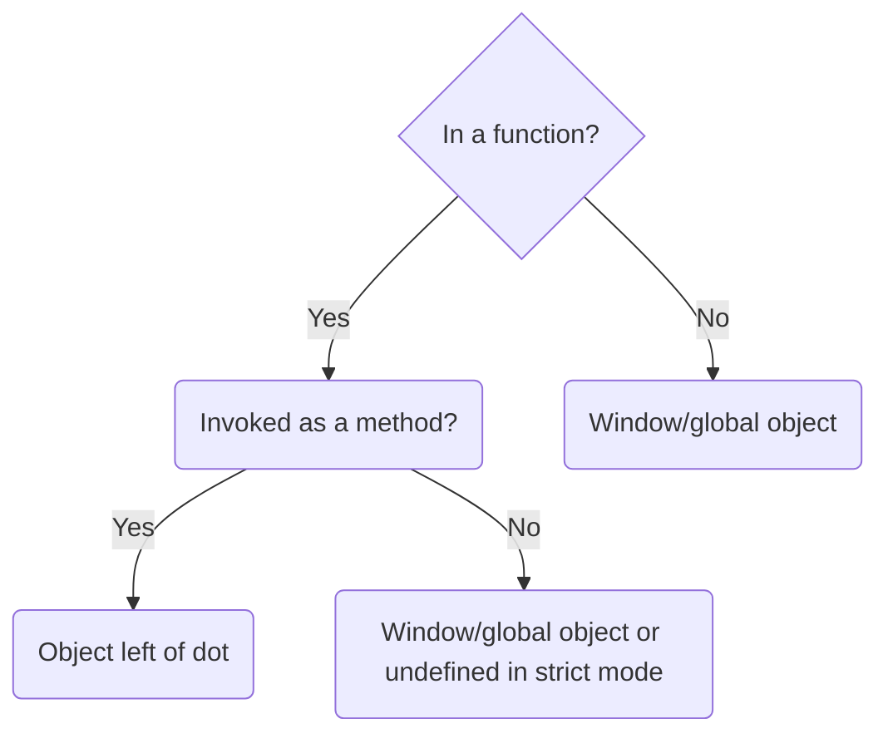

The `this` keyword refers to the context where a piece of code is executed.

## Common Cases




### Global Context

```javascript
console.log(this); // Window/global object
```

### Function Invocation

```javascript
function logThis() {
    console.log(this);
}
logThis(); // Window/global object (undefined in strict mode)
```

### Method Invocation

```javascript
class MyClass {
    static method() {
        console.log(this);
    }
}
MyClass.method(); // MyClass
```

### Method as Standalone Function

```javascript
class MyClass {
    static method() {
        console.log(this);
    }
}
const test = MyClass.method;
test(); // undefined (in strict mode)
```

## Special Cases
### `call()`, `apply()`, `bind()`

These methods explicitly set `this`:

```javascript
function logThis() {
    console.log(this);
}
const obj = {name: 'Example'};
logThis.call(obj); // {name: 'Example'}
```

### Constructor Functions and `new` Keyword

```javascript
function Person(name) {
    this.name = name;
}
const p = new Person('John');
console.log(p); // Person {name: 'John'}
```

### Arrow Functions

Arrow functions capture `this` from the surrounding lexical scope:

```javascript
const obj = {
    arrowMethod: () => {
        console.log(this); // Window/global object
    }
};
obj.arrowMethod();
```

### Event Listeners

In event listeners, `this` refers to the element that triggered the event:

```html
<button id="btn">Click Me</button>
<script>
    document.getElementById('btn').addEventListener('click', function() {
        console.log(this); // <button id="btn">Click Me</button>
    });
</script>
```

## Summary

- In methods: `this` refers to the object the method belongs to.
- In global context: `this` refers to the global object.
- In functions: `this` typically refers to the global object (undefined in strict mode).
- In event handlers: `this` refers to the element that received the event.
- `call()`, `apply()`, and `bind()` can explicitly set `this`.
- Arrow functions capture `this` from the surrounding scope.