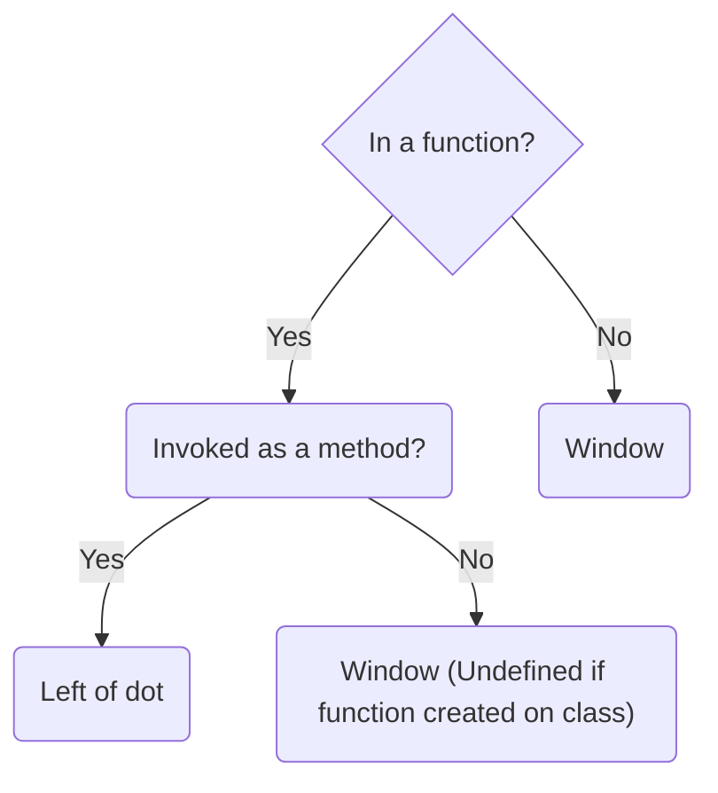

The **`this`** keyword refers to the context where a piece of code, such as a function's body, is supposed to run
### Common case



##### Standalone / Global context

```js
console.log(this)
// window
```
##### Function, invoked standalone

```js
function logThis(){
	console.log(this)
}

logThis();
// window
```
##### Function, invoked as a method (using dot notation)

```js
class MyClass {
    static method(){
        console.log(this)
    }
}

MyClass.method();
// MyClass
```

##### Method written is a class, but invoked as a standalone function

```js
class MyClass {
    static method(){
        console.log(this)
    }
}

const test = MyClass.method();
test()
// undefined
```

##### Method written in an object, but invoked standalone
```js
const myObject = {
    method: function(){
        console.log(this)
    }
}

function outer(input){
	// input = myObject.method
    input() // invoked here
}

outer(myObject.method)
// window
```

---
### Special case

##### `call()`, `apply()`, `bind()` -> Up to you

This functions are used to explicitly control the value of `this`

```js
function logThis(){
    console.log(this)
}

const gordon = {name: 'Gorder'}

logThis.call(gordon)
// { name: 'Gorder' }

logThis.apply(gordon)
// { name: 'Gorder' }

logThis.bind(gordon)()
// { name: 'Gorder' }
```
##### `new` -> New empty object

Constructor function

```js
function Person(name){
    // this = {}
    this.name = name
    // return this;
}

const p = new Person('Gorden')

console.log(p)
// Person { name: 'Gorden' }
```

Class

```js
class Person {
    constructor(name){
        // this = {}
        this.name = name
        // return this
    }
}

const p = new Person('Gorden')
console.log(p)
// Person { name: 'Gorden' }
```

```js
class Test {
    constructor(name){
        this.name = name
    }

    thisOutside = this
}

const t = new Test()
t.thisOutside === t
// true
```

```js
class Parent {
    constructor(){
        // inside
    }
    // outside
}

class Child extends Parent {
    constructor(){
        super()
        // inside
    }
    // outside
}

const child = new Child()
```

##### Arrow Function -> Outside 'this' when function is created

```js
const o = {
    arrowMethod: /* & */ () => {
        console.log(this) // window, value of this at '&' is window, object 'o' is in window
    }
}

o.arrowMethod()
```

##### Super method -> Outside 'this' when function is invoked

```js
class Parent {
    static parentMethod(){
        console.log(this)
    }
}

class Child {
    static childMethod(){
        // this = Child
        super.parentMethod();
    }
}

Child.childMethod() // Child

const test =  Child.childMethod
test() // undefined
```

---
### Built in functions

```html
<button>Click Me</button>

<Script>
	const btn = document.querySelector('button)
	btn.addEventListener('click' function(){
		console.log(this) // button
	})
</Script>

```

```js
class MyClass {
    static method() {
        console.log(this)
    }
}

[1].forEach(MyClass.method); // undefined
```

---
### Summary

##### The `this` keyword refers to different objects depending on how it is used
- When used within a method of an object, `this` points to that object.
- When used by itself, `this` points to the global object.
- Within a function, `this` typically points to the global object.
- In a function under strict mode, `this` becomes undefined.
- During an event, `this` points to the element that triggered the event.
- Methods such as `call()`, `apply()`, and `bind()` can reassign `this` to any desired object
